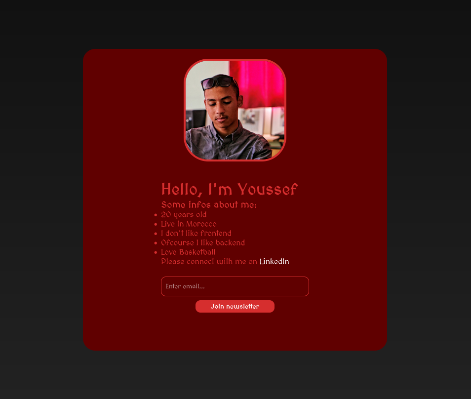
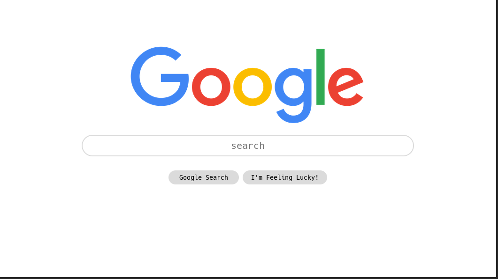
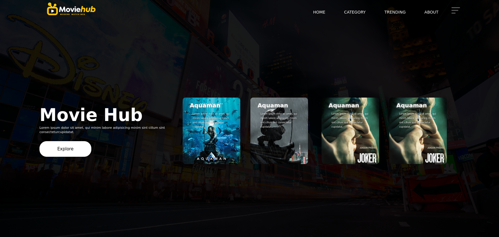
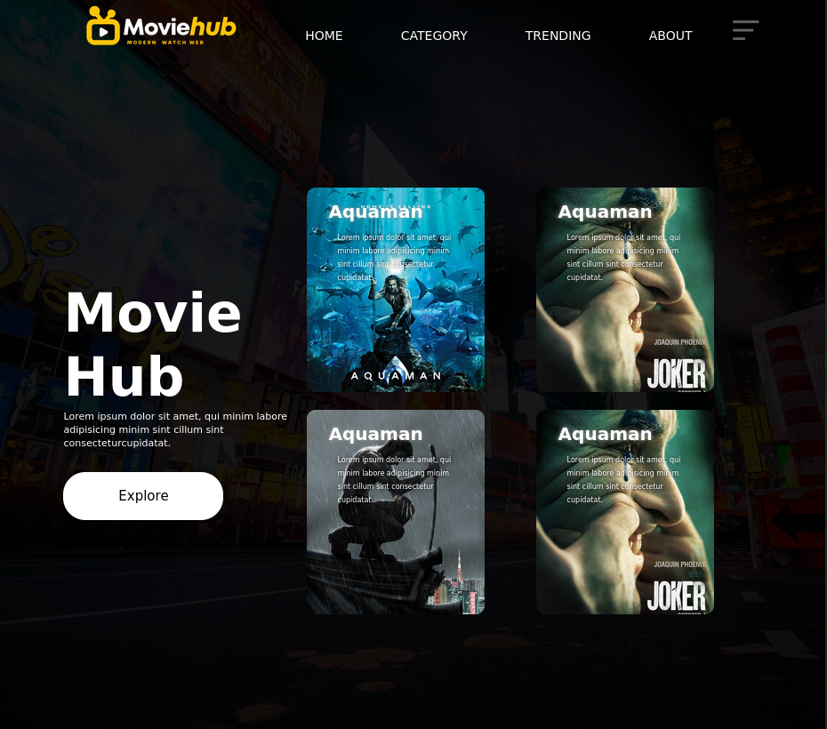
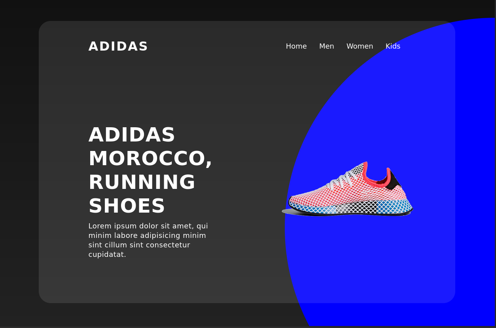
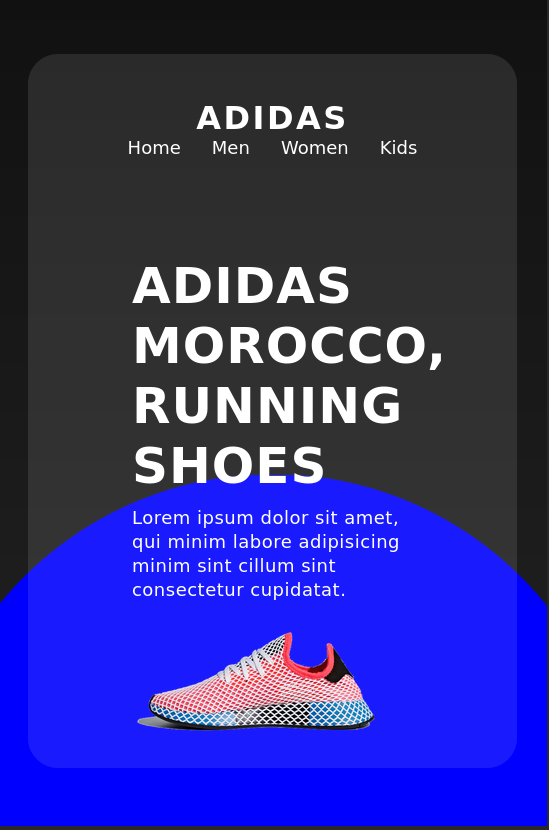
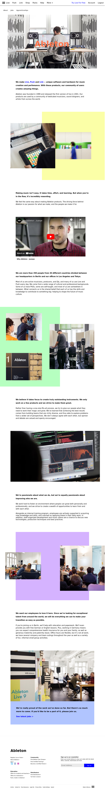

# I Hate Frontend

First of all I hate frontend, I'm forced to learn the basics of it that's why I make this repo to make some project using HTML CSS & JS.

## 0x01-Personal Website

## 0x02-Google Clone

## 0x03-Movie Site Clone

## 0x04-Glass Effect Website

## 0x0A Abeleton Clone
This is my first clone, it's just a beginner clone, it's not responsive at all, it took me 2 days to finish I struggle a lot but I finished it, I learned the box model, the position the grid and lot more. I'm proud of my self, because it's been just 1 week for me learning frontend and always remembe IHateFrontEnd.

### ORIGINAL
Official Site:		[Ableton.com](https://www.ableton.com/en/about)

### CLONE

## 0x0B Abstract Clone
Official Site: [Abstract.com](https://help.abstract.com/hc/en-us)

go to my clone => [myclone.com](https://thenew-programer.github.io/myclone.com/)
